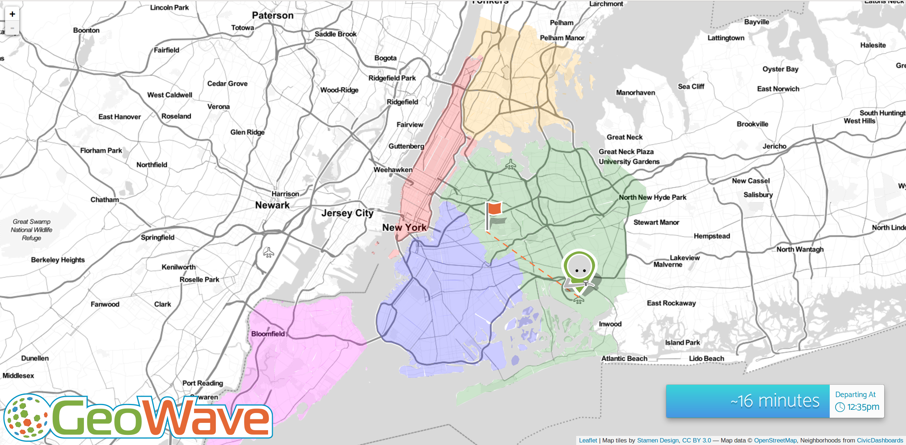

#NYC-Taxi Demo
##About
The nyc-taxi demo is a demonstration of some of the features of the Geowave service. It takes in a set of information from the NYCTLC (New York City Taxi & Limousine Commission) and outputs how long a taxi trip from one chosen point on the map to another would be based on the data set.

The NYCTLC trip data can be find [here.](http://www.nyc.gov/html/tlc/html/about/trip_record_data.shtml)





##Installing the Project
After pulling down the repository, cd into the **/nyc-taxi/** directory and run 
```
$ mvn install
```
This will resolve all of the dependencies and create the **nyc-taxi.war** in the **/nyc-taxi/nyctlc-webapp/target/** directory. This is the war that will need to be deployed to successfully run the demo.

##Deploying the Demo
The demo-ui folder will contain some version of the geowave-demo-ui in [this repository.](https://github.com/venicegeo/geowave-demo-ui) 
To deploy the demo, first cd into the **/demo-ui/** directory and call
```
$ npm install
```
Next, call
```
$ NODE_ENV=production npm run build
```
Which will create the **/dist/** directory in **/demo-ui/** . This is the folder that holds the static content. When trying to deploy the demo to your server, make sure that your content variable is pointing to **/demo-ui/dist/**

##Ingesting Data and Running the Demo
Assuming that the Hadoop software stack (Hadoop, Zookeeper, and Accumulo) has been successfully implemented, the following steps will show how to ingest a set of data.

To install the Geowave command line, follow the instructions [here](https://ngageoint.github.io/geowave/documentation.html#installation-from-rpm) to install Geowave 0.9.2.

Next, take the **geowave-format-0.9.2-SNAPSHOT.jar** file that you've should have been built in the **/nyctlc-format/target/** directory and drop it into the **/usr/local/geowave/tools/plugins/** directory that should have just been installed in the geowave-0.9.2 directory. This will allow the service to properly ingest the nyctlc data. 

To actually ingest the data, first, create a directory in which you can keep all data that you wish to ingest. something such as **~/ingest/** is fine. Put the .csv file(s) in there. If you are running the demo on a personal computer, it is not recommended that you use more than one month's worth of data.

The next step is to create a store and an index so that the data can be read and interpreted. Create a store by using the command:
```
$ geowave config addstore -t accumulo nycstore \ 
      --gwNamespace NAME_OF_TRIPDATA_FILE \ 
      --zookeeper ZOOKEEPER_HOSTNAME:2181 \
      --instance ACCUMULO_INSTANCE_NAME \
      --user USERNAME \
      --password PASSWORD
```
* When entering in the name of the tripdata file, remove the .csv and make sure that the name does not have a hyphen '-' in it. You may have to rename the file itself.

Next, create an index using the following command:
```
$ geowave config addindex -t nyctlc-sst nycindex 
```
* Specifying "-t" lets the index know that it will be reading tripdata from the NYCTLC


Finally, run the ingest call on the data with:
```
$ geowave ingest localtogw ./ingest nycstore nycindex \ 
	  -f nyctlc
```

At this point the data should be ingested, and the demo should be ready to use.

